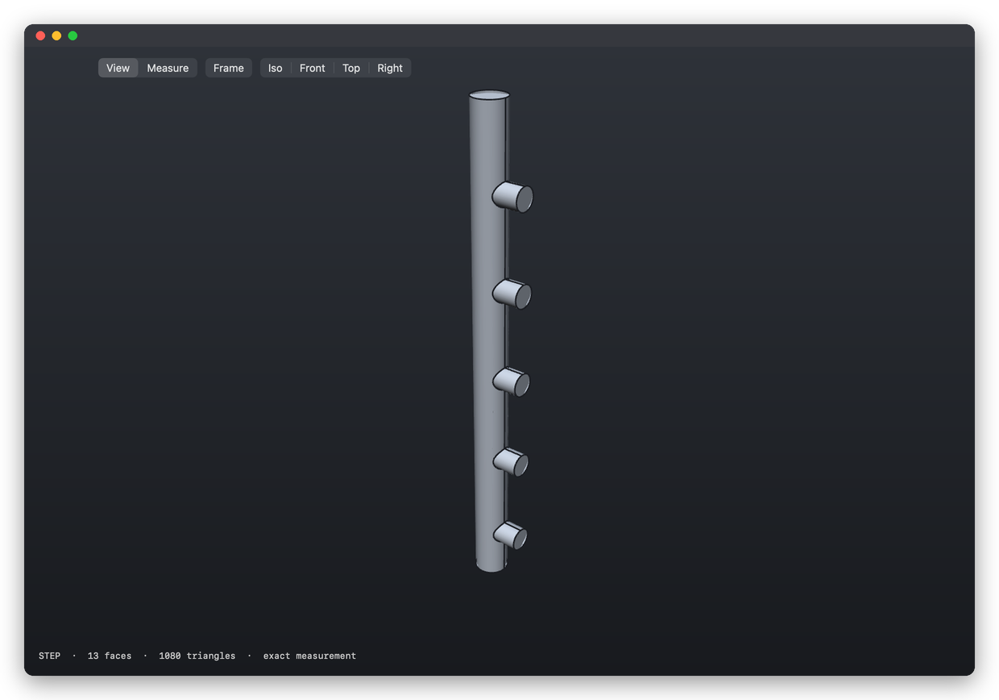
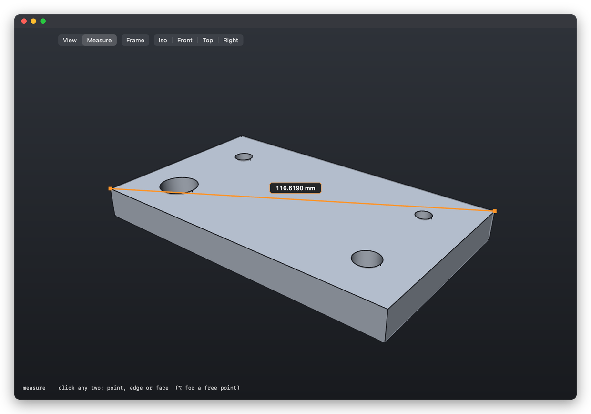
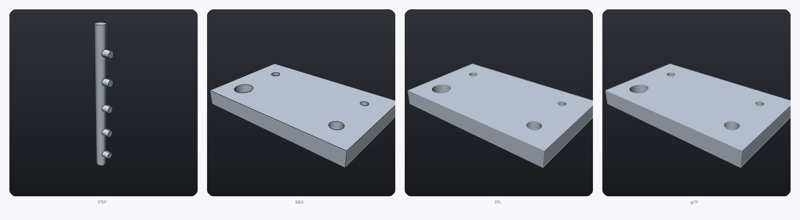
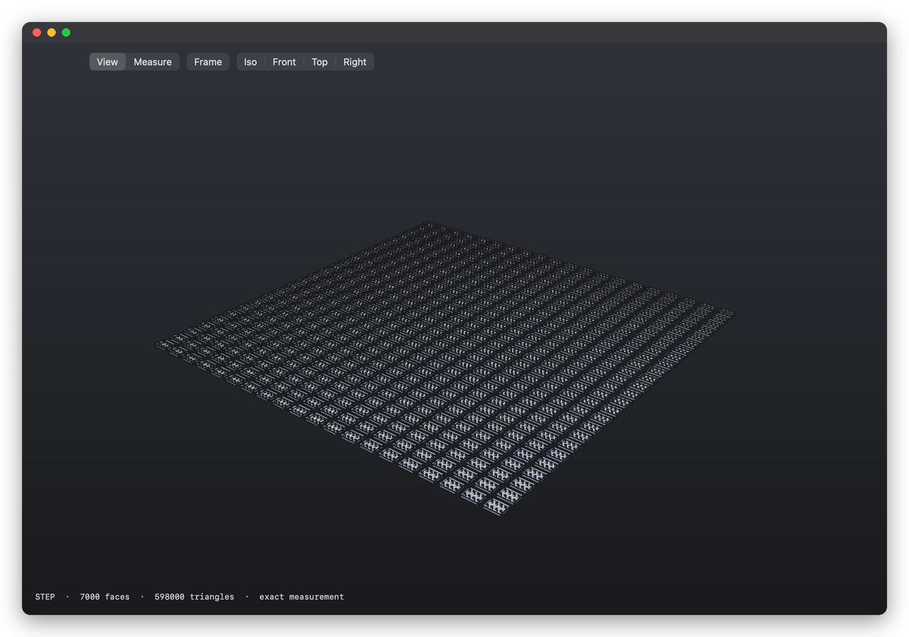
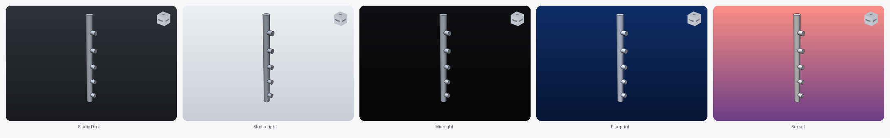
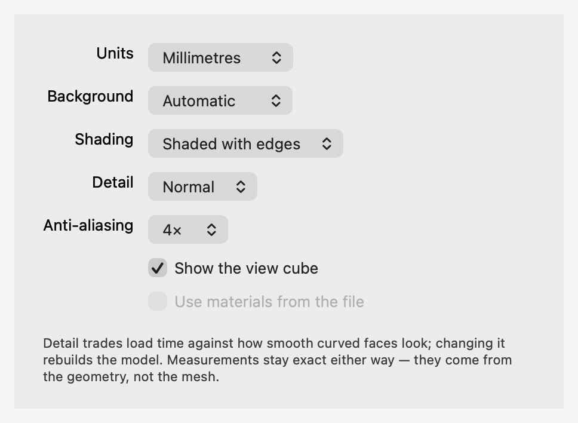

<div align="center">

# CAD Viewer

**A fast, native macOS viewer for CAD files. Open a part, look at it, measure it, close it.**

[]()
[]()
[]()



</div>

## Why

Previewing a STEP file on a Mac is worse than it should be. eDrawings is slow
and crash-prone. Fusion 360 is excellent for modelling but makes you import a
file just to look at it. Neither treats "I just want to see this part and check
a dimension" as the common case that it is.

CAD Viewer does that one job: **open the file immediately, show it properly,
and give exact numbers.**

## What it does

- **Opens STEP, IGES, BREP, STL, OBJ, glTF/GLB and VRML** — double-click, drag
  in, or ⌘O. A 500-part assembly is on screen in about a second.
- **Measures exactly.** Not from the triangle mesh — from the underlying
  geometry. A hole reports its true diameter, a tube its true length.
- **Previews in Finder.** Spacebar gives an interactive model you can rotate,
  and files get real thumbnails instead of a generic icon.
- **Behaves like a Mac app.** Multiple windows, ⌘W closes one and the app stays,
  a view cube for orientation, light and dark.
- **Settings that matter.** Units, background, shading, level of detail and
  anti-aliasing — ⌘, and every open window updates.

## Measurement you can trust

Most viewers measure the display mesh, so the answer is only as good as the
tessellation. This one queries the B-rep: `BRepAdaptor_Surface` for analytic
radii, `BRepExtrema_DistShapeShape` for distances, `GeomAPI_ProjectPointOnSurf`
to pull free points onto the real surface.

Verified against a part built to known dimensions — 100 × 60 × 10 mm with holes
of ⌀12, 8, 6 and 5:

| measurement | result | true value |
|---|---|---|
| hole diameters | 12.0000 / 8.0000 / 6.0000 / 5.0000 mm | exact |
| plate thickness, face to face | 10.000000 mm | 10 |
| corner to corner | 116.6190 mm | √(100²+60²) |
| body diagonal | 117.0470 mm | √(100²+60²+10²) |
| tube length, rim to rim | 600.000000 mm | 600 |
| four edges of a face | 320.0000 mm, closed loop | 2×(100+60) |
| volume | 57887.279 mm³ | 60000 − π·67.25·10 |



Click any two things — a vertex, an edge, a face, or a free point on a surface.
Snapping prefers vertices, then edge midpoints, then circle centres, with a
preview showing where the click will land. ⇧-click builds a selection: several
edges report a total length and whether they form a connected chain.

## Formats

| format | tier | select faces | exact measurement |
|---|---|---|---|
| **STEP** `.step` `.stp` | B-rep | ✅ | ✅ |
| **BREP** `.brep` | B-rep | ✅ | ✅ |
| **IGES** `.iges` `.igs` | B-rep | ✅ | partial¹ |
| **STL** `.stl` | mesh | — | — |
| **OBJ** `.obj` | mesh | — | — |
| **glTF** `.gltf` `.glb` | mesh | — | — |
| **VRML** `.wrl` | mesh | — | — |

¹ IGES is a surface format: it loses solids and turns analytic cylinders into
NURBS, so measurements there are approximate.

The app knows which tier a file is and disables exact tools rather than
reporting a number it cannot stand behind.



## Finder integration

Two QuickLook extensions ship inside the app:

- **Thumbnails** — real model renders in place of a generic document icon
- **Preview** — press space and rotate the part in the preview pane

One caveat, and it is not specific to this app: for file types that macOS
declares itself — STL, OBJ, GLB — the system's own thumbnail generator, or any
other QuickLook plugin you have installed, can take precedence, and the choice
is not the app's to make. The types CAD Viewer declares — STEP, IGES, BREP,
glTF, VRML — are always its own.



## Orientation and looks

A view cube in the corner shows which way the part is facing; click a face to
snap to it. It shares the picking buffer with the model, so a click on the cube
is resolved by the same pass that picks geometry.

Five backgrounds, under **View ▸ Background**, remembered between launches.



## Settings

**⌘,** opens Settings; changes apply immediately to every open window and are
remembered.

| | |
|---|---|
| **Units** | Millimetres, centimetres, metres or inches. Only the display changes — measurement is always computed in millimetres from the geometry. |
| **Background** | Automatic (follows the system theme) or a fixed scene. |
| **Shading** | Shaded with edges, shaded, or wireframe with hidden lines removed. |
| **Detail** | How finely curved faces are tessellated. Trades load time against smoothness; measurements are unaffected, because they come from the geometry rather than the mesh. |
| **Anti-aliasing** | Off, or 2×/4×/8× multisampling — only the levels your GPU supports are offered. Apple silicon tops out at 4×. |



## Install

```sh
brew tap andriivelhov/tap     # once
brew install --cask cadviewer
```

Recent Homebrew versions ask you to trust a third-party tap before they will
load a cask from it. If you see *"Refusing to load cask … from untrusted tap"*,
run `brew trust andriivelhov/tap` and install again.

Or download the [latest release](../../releases/latest) and drag it to
Applications. The app is Developer ID signed and notarized, so it opens without
a Gatekeeper warning.

Installing through Homebrew also registers the two Finder extensions, so
thumbnails and previews work immediately. After a manual drag-to-Applications
install they stay dormant until the app has been launched once — open it once
and Finder catches up.

## Build from source

```sh
brew install opencascade
cmake -S . -B build && cmake --build build -j8
open build/CADViewer.app
```

Release builds bundle the OCCT libraries into the app, so the result runs on a
machine that has never seen Homebrew:

```sh
./packaging/build_release.sh "Developer ID Application: Your Name (TEAMID)" [notary-profile]
```

## How it works

| | |
|---|---|
| **Geometry** | [Open CASCADE](https://dev.opencascade.org) 7.9 — reads the formats and answers the exact-geometry queries |
| **Rendering** | Metal, 4× MSAA, with feature edges taken from the topology rather than derived from the mesh |
| **Picking** | Every fragment writes its entity id to a second render target, so a click is a one-texel lookup — pixel-exact, no raycasting |
| **Shell** | AppKit, one window per part, plus two QuickLook app extensions |

The geometry core (`core/`) is plain C++ with no Apple dependencies; the app and
extensions (`app/`) are Objective-C++ sitting directly on it, with no bridging
layer. Roughly 4,500 lines.

`docs/ENGINEERING.md` has the build notes, the verification tooling, and a
catalogue of the platform traps hit along the way — Metal winding order, depth
precision, QuickLook extension requirements and several others — with what each
one actually cost.

## Not yet

- Textures and materials are read by OCCT but not displayed; everything renders
  in one matte grey (the Settings checkbox for it is disabled until it is)
- No component/assembly sidebar
- No section planes
- PLY cannot be read (OCCT's PLY support is write-only)
- Finder thumbnails for system-declared types (STL, OBJ, GLB) may be produced
  by macOS or another installed QuickLook plugin instead of this app

## Licence

The app is MIT. Open CASCADE is LGPL-2.1 with an exception permitting use in
proprietary software; its licence ships in the app bundle.
